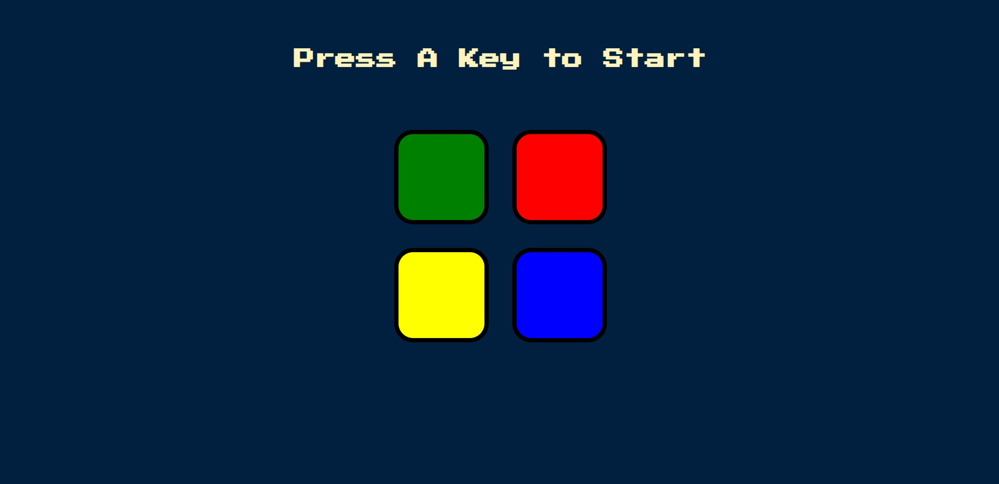
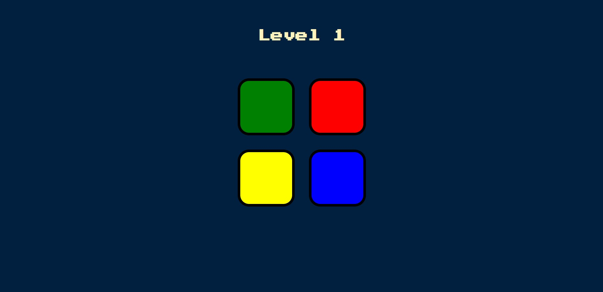
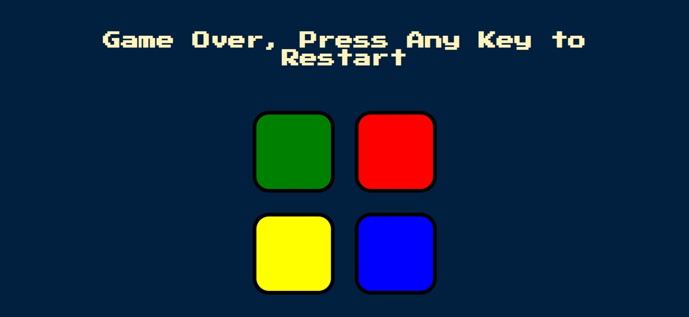
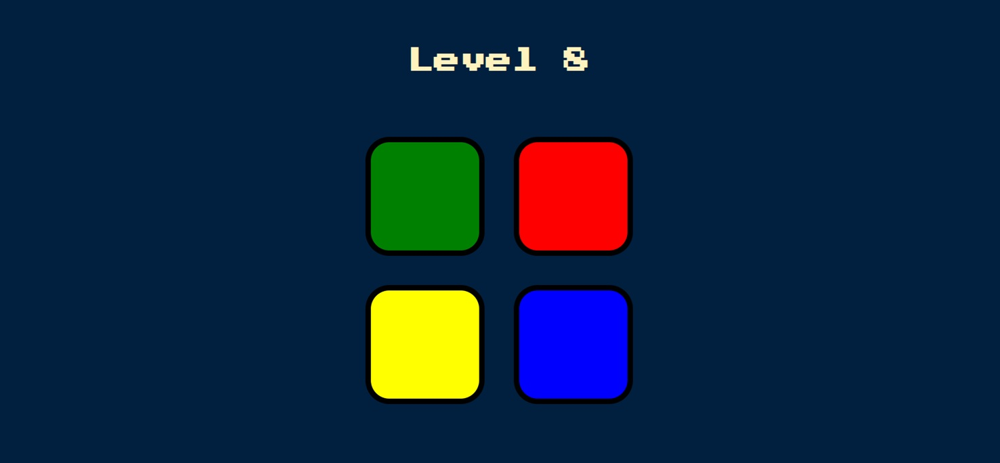
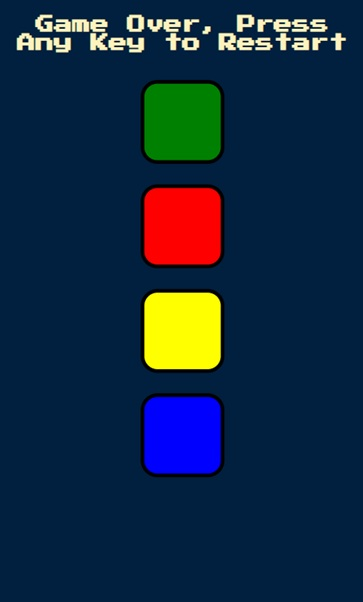

# Simon Game - Web Application Solution

This is a responsive, interactive web implementation of the classic Simon memory game, built with native web technologies and accelerated using the jQuery library.

## Table of contents

- [Overview](#overview)
  - [The challenge](#the-challenge)
  - [Screenshot](#screenshot)
  - [Links](#links)
- [My process](#my-process)
  - [Built with](#built-with)
  - [What I learned](#what-i-learned)
  - [Continued development](#continued-development)
- [Author](#author)

## Overview

### The challenge

Users should be able to:

- View the optimal layout for the game interface depending on their device's screen size.
- Initiate the game dynamically by pressing any keyboard key.
- Observe a randomized sequence generated by the game engine, where targeted buttons flash and play distinct audio tracks.
- Click the interactive color buttons to repeat the memorized pattern.
- Receive visual triggers (a brief red background flash) and audio feedback when an incorrect button sequence is entered.
- See the application reset automatically to Level 0 upon failure, allowing immediate restarts via keyboard input.

### Screenshot


> Figure 1: The landing state of the application interface before initialization. The typographic header displays the "Press A Key to Start" prompt, waiting for global keyboard input vectors to trigger the primary game execution loop.

> Figure 2: Successful progression to Level 1. The document header updates dynamically to reflect the active level counter state as the game pattern array initializes its first randomized sequence item.

> Figure 3: Exception handling state. When the user selection array mismatches the game pattern collection, the interface flashes an explicit red background utility state (.game-over) and prompts the user to reset the execution loop.

> Figure 4: Advanced execution state demonstrating memory and array stability during a high-level sequence loop (e.g., Level 8), proving the reliability of the underlying logical pattern parsing engine.

> Figure 5: Mobile viewport validation. The flexbox grid container shifts layout distributions responsively, scaling the interactive color matrix safely to maintain full user interface accessibility on compact touchscreen mobile displays.

### Links

- Solution URL: [GitHub Source Code](https://github.com/Jusnow1608/simon-game-javascript)
- Live Site URL: [GitHub Pages Live Preview](https://jusnow1608.github.io/simon-game-javascript/)

## My process

### Built with

- Semantic HTML5 markup
- CSS custom properties & Box Shadows
- Flexbox layouts for structural element alignment
- Mobile-first & Responsive design workflows
- [jQuery (v3.7.1)](https://jquery.com/) - JavaScript library for unified DOM query management and animations

### What I learned

During the development of this project, I significantly deepened my understanding of the **Separation of Concerns** principle. Instead of injecting inline visual styles directly via JavaScript, I shifted to managing state by toggling CSS classes.

I am particularly proud of implementing clean event handling and input parsing via jQuery, especially tracking the user's progress through individual array indices:

```js
// Processing user interaction vectors and routing to validation pipelines
$(".btn").on("click", function() {
    var userChosenColour = $(this).attr("id");
    userClickedPattern.push(userChosenColour);
    
    var currentLevel = userClickedPattern.length - 1;
    checkAnswer(currentLevel);
    
    playSound(userChosenColour);
    animatePress(userChosenColour);
});
```

I also mastered handling asynchronous states using timed execution loops to create UI flash indicators:

```CSS
/* Predefined visual state token handled via script triggers */
.pressed {
  box-shadow: 0 0 20px white;
  background-color: grey;
}
```

```js
// Structural state management loop using macro-task scheduling wrappers
function animatePress(currentColour) {
  $("#" + currentColour).addClass("pressed");
  setTimeout(function() {
    $("#" + currentColour).removeClass("removeClass");
  }, 100);
}
```

### Continued development
Moving forward, I intend to focus on:
- Asynchronous Execution Flows: Moving away from standard nested setTimeout loops and migrating toward modern JavaScript Promises and async/await patterns to build cleaner sequence pipelines.
- Accessibility (a11y): Enhancing keyboard navigation support, ensuring users can interact with the game tiles using structural control keys (e.g., Tab, Space, Enter) instead of relying solely on pointer click events.

### Author
- GitHub - [@Jusnow1608](https://github.com/Jusnow1608)
- Frontend Mentor - [@Jusnow1608](https://www.frontendmentor.io/profile/Jusnow1608)
- LinkedIn - [@Justyna-Nowak-Szrajnert](https://www.linkedin.com/in/justyna-nowak-szrajnert-a5168713b/)
